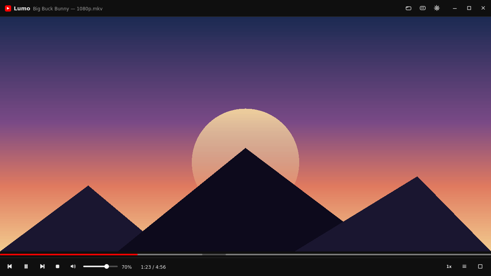

# Lumo — a lightweight, YouTube-like video player for Windows

**Lumo** is a small, fast video player for Windows with a clean YouTube-style
interface. It is built with **Python + PyQt5** and uses the **mpv** engine
(`libmpv`), so it plays **MP4 / MKV / WebM** with full codec support
(**x264 / x265 / AV1**) — both local files and direct streaming links.



---

## ✨ Features

| Feature | Description |
|---|---|
| 🪶 Lightweight | Thin Qt UI + mpv engine. No browser, no Electron. |
| 🌐 Online playback | Direct MP4 / MKV / WebM links (x264 / x265 / AV1). |
| ⏳ Bounded stream cache | mpv buffers only a window around the current position — never the whole file. |
| 📊 Buffer on the seek bar | The buffered region is drawn (grey) on the progress bar, plus % / MB in the top bar. |
| 💬 Subtitles | Drag & drop `.srt` / `.ass` / `.ssa` / `.vtt`; font, size, color, weight, outline and shadow, plus an optional background box. |
| 🔤 Subtitle sync | `,` / `.` shift subtitles ±0.10 s; `/` resets. |
| 🎬 YouTube look | Dark & light themes, red progress bar, crisp vector icons. |
| 🪟 Frameless window | Custom title bar (min / max / close), drag to move, resize from edges. |
| 📌 Overlay controls | Controls float **over** the video — the video never resizes. |
| 🙈 Auto-hide | In fullscreen, controls and cursor hide after a few seconds; keyboard seeks don't reveal them. |
| 🔊 Volume OSD | Numeric % + a top-left OSD on change (font / color / opacity / background configurable). |
| 🔗 URL panel | Paste a link when idle, with Paste / Play / Open file. |
| 🎞 Playlist | Open several files at once, next / previous, **auto-advance on end**, right-docked sidebar. |
| 🕘 Recent files | Quick re-open of the last videos/links. |
| 💾 Portable settings | `lumo_settings.ini` next to the program + Reset to defaults. |
| 🧭 Remembers state | Window size/position, volume and playback speed. |
| ⏲ Seek OSD | Optional time display while seeking. |

### Keyboard shortcuts

| Key | Action |
|---|---|
| `Space` / `K` | Play / Pause |
| `F` / `Enter` | Fullscreen |
| `M` | Mute |
| `S` | Stop |
| `←` / `→` | Seek ±step (default 2 s, exact) |
| `↑` / `↓` | Volume ±step (default 5 %) |
| `J` / `L` | Seek ±10 s |
| `,` / `.` | Subtitle sync ±0.10 s |
| `/` | Reset subtitle sync |
| `N` / `P` | Playlist previous / next |
| `Ctrl+O` | Open file |
| `Esc` | Exit fullscreen |
| `Mouse wheel` | Volume |
| `Middle click` | Fullscreen |
| `Double click` | Play / Pause |

---

## 📦 Install & run (Windows)

### 1. Python
Install Python 3.9+ from [python.org](https://www.python.org/downloads/)
(tick **Add Python to PATH**).

### 2. Dependencies
```bat
pip install -r requirements.txt
```

### 3. Get `libmpv-2.dll` (important!)
The mpv engine needs **`libmpv-2.dll`**. ⚠️ This file is **not** inside the
normal `mpv-x86_64-*.7z` package — that one only ships `mpv.exe`. The DLL is
in the **dev** builds.

- **Automatic:** double-click `get_libmpv.bat` — it downloads the latest build
  and copies the DLL next to the program.
- **Manual:** download an archive whose name starts with **`mpv-dev-x86_64-`**
  (not `mpv-x86_64-`) from one of:
  - <https://sourceforge.net/projects/mpv-player-windows/files/libmpv/>
  - <https://github.com/zhongfly/mpv-winbuild/releases/latest>

  Extract it and copy `libmpv-2.dll` next to `main.py` (or anywhere on `PATH`).

> `run.bat` and `build.bat` also fetch the DLL automatically if it's missing.

### 4. Run
```bat
run.bat
```
or:
```bat
python main.py
```

---

## 🧱 Build a standalone EXE

```bat
build.bat
```
The output is `dist\Lumo\Lumo.exe`. The script generates the icon, downloads
`libmpv-2.dll` if needed and bundles it into the build.

> `libmpv-2.dll` must sit next to the exe (or be on `PATH`), otherwise the app
> starts but shows a "mpv engine not loaded" error.

---

## 🗂 Project structure

```
lumo/
├── main.py            ← the whole app (UI + mpv engine), single file
├── requirements.txt   ← PyQt5, python-mpv
├── run.bat            ← install deps + fetch libmpv + run
├── build.bat          ← PyInstaller build -> dist\Lumo\Lumo.exe
├── get_libmpv.bat     ← automatic libmpv-2.dll download (wrapper)
├── get_libmpv.ps1     ← PowerShell libmpv downloader
├── check_engine.py    ← diagnostics: why the engine won't load
├── make_icon.py       ← generates icon.ico
├── smoke_test.py      ← headless UI test (no mpv engine)
├── screenshot.png     ← screenshot used in this README
└── README.md          ← this file
```

---

## ⚙️ Settings

The **Settings** dialog has five tabs — **General** (theme, seek/volume step,
auto-hide delay, stream cache), **Subtitles**, **OSD**, **Shortcuts** and
**About** — plus **Apply / OK / Cancel** and **Reset to defaults**. The dialog
is frameless with a draggable header.

- **Seek step** — ←/→ amount (default 2 s)
- **Volume step** — ↑/↓ amount (default 5 %)
- **Hide controls after** — fullscreen auto-hide delay (default 3 s)
- **Stream cache size** — forward cache cap (default 80 MiB)
- **Backward cache** — backward cache cap (default 16 MiB)
- **Subtitle font / size / color / weight** — full Windows font list, size,
  Regular / Medium / SemiBold / Bold, outline width, shadow depth (live apply)
- **Subtitle background box** — on/off, color and opacity
- **Volume / Seek OSD** — top-left, font 6–36 px, color, opacity (5 % steps),
  background on/off. Rendered by the mpv engine itself — no black box artifact.
- **Playback speed** — 0.25x … 2x

Settings are stored in **`lumo_settings.ini` next to the program** (portable);
if that location isn't writable, `%APPDATA%\Lumo` is used.

---

## 🔧 Technical notes

- **MKV / x265 playback** is native (via mpv) — browsers can't do this.
- **Bounded cache:** `cache=yes` + `demuxer-max-bytes` keep only a window
  around the current position; the buffered region comes from the
  `demuxer-cache-state` property and is painted on the seek bar.
- **Mouse over video:** `input-cursor-passthrough` passes pointer events from
  the mpv window to the Qt widget below, so middle-click / double-click / wheel
  are handled in Qt. No widget is layered over the video, so the picture always
  renders correctly.
- **Overlay controls** are separate native child windows, so showing/hiding
  them never resizes the video.
- **Subtitle box:** requires `sub-border-style=background-box` on modern mpv.
- **Font weight:** libass has no numeric weight; Medium/SemiBold resolve the
  matching font variant (e.g. "Segoe UI Semibold").
- **Resize:** `wid` of the mpv window is re-set on every `resizeEvent` (Windows
  quirk).

---

## ❓ Troubleshooting

| Problem | Fix |
|---|---|
| `Could not load the mpv engine` | Run `python check_engine.py` for the exact cause. |
| python-mpv missing | `pip install python-mpv` |
| DLL missing | Run `get_libmpv.bat`. |
| 32-bit Python + 64-bit DLL (or vice versa) | Use a matching build: 64-bit Python → `mpv-dev-x86_64-*.7z`, 32-bit → `mpv-dev-i686-*.7z`. |
| Error 126 | Install the latest Microsoft Visual C++ Redistributable (`vc_redist.x64.exe`). |
| Some links won't play | The server must support Range requests (direct file links). Live/DRM streams are not supported. |
| RTL subtitles render reversed | Use a UTF-8 `.srt` file. |

---

## License

Free for personal use. The mpv engine and libmpv are © their respective owners
(mpv is GPL/LGPL — see <https://mpv.io>).
